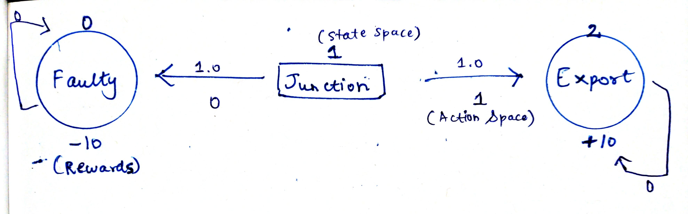

# EX-01<p align="center"> MDP REPRESENTATION </p>

## AIM:
To represent a Markov Decision Process(MDP) problem in the following ways.
  1. Text representation
  2. Graphical representation
  3. Python - Dictonary representation

## PROBLEM STATEMENT:

### Problem Description:
The problem is to develop a Reinforcement Learning model for product detection in a manufacturing factory. The model should determine whether a product is ready to be exported or faulty based on its features. The goal is to optimize the production process and reduce the number of faulty products while maximizing the number of products ready for export.

### State Space:
{F,J,E} -> {0,1,2}

where,
- F -> Faulty
- J-Juction(decision making state)
- E -> Export

### Sample State:
Dimensions: (Length, Width, Height) = (10 cm, 5 cm, 2 cm).
Weight: 100 grams.
Color: Blue.

### Action Space:
{F,E} -> {0,1}
 where,
  "E->Export" ,
  "F->Mark as Faulty"

### Sample Action:
E-> 1<br>
product is ready for Export.

### Reward Function:
R = { +10 for correctly exporting a ready product,
-10 for exporting a faulty product}

### Graphical Representation:


## PYTHON REPRESENTATION:
```py
P = {
    0:{
        0: [(1.0,0,0.0,True)],
        1: [(1.0,0,0.0,True)]
    },
    1:{
        0: [(1.0,0,0.0,True)],
        1: [(1.0,2,1.0,True)]
    },
    2:{
        0: [(1.0,2,0.0,True)],
        1: [(1.0,2,0.0,True)]
    }
}
```
## OUTPUT:
```
{0: {0: [(1.0, 0, 0.0, True)], 1: [(1.0, 0, 0.0, True)]},
 1: {0: [(1.0, 0, 0.0, True)], 1: [(1.0, 2, 1.0, True)]},
 2: {0: [(1.0, 2, 0.0, True)], 1: [(1.0, 2, 0.0, True)]}}
```

## RESULT:
Thus the given Markov Decision Process(MDP) problem is represented in the following ways.
  1. Text representation
  2. Graphical representation
  3. Python - Dictonary representation

